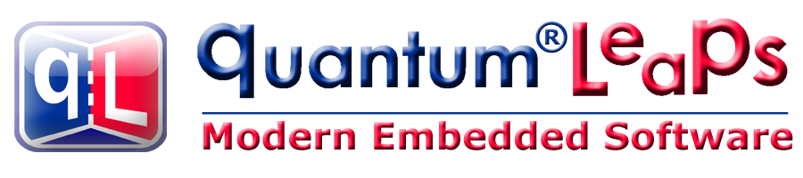

<h1 align="center" style="font-size:xxx-large;">Quantum Leaps Modern Embedded Software</h1>

# State Machines & Tools for Embedded Systems
We’re on a mission to bring Quantum Leaps in quality and productivity to embedded software development. Our open source QP™ real-time embedded frameworks (RTEFs), the freeware QM™ modeling tool, and the QTools™ collection enable event-driven architecture, finite state machines, model-based design and automatic code generation.

## Embedded Software
**QP™ Real-Time Embedded Frameworks (RTEFs)** 
Quantum Leaps' [QP/C and QP/C++ real-time embedded frameworks (RTEFs)](https://www.state-machine.com/products/qp) provide modern, open source architecture and runtime environment based on event-driven Active Objects (Actors) and Hierarchical State Machines. Ideal for ARM Cortex-M and other 32/16-bit microcontrollers. Also integrated with (embedded) Linux/POSIX.

## Host-Based Tools
**QM™ Model-Based Design Tool** 
[QM™ (QP Modeler)](https://www.state-machine.com/products/qm/) is a freeware model-based design (MBD) and automatic code generation tool for designing software based on finite state machines (UML statecharts) and the QP™ frameworks.

**QTools™ Collection** 
[QTools™ Collection](https://www.state-machine.com/products/qtools/) of various open source host-based tools for working with the QP frameworks, such as tools for: software tracing, unit testing, monitoring and prototyping.
