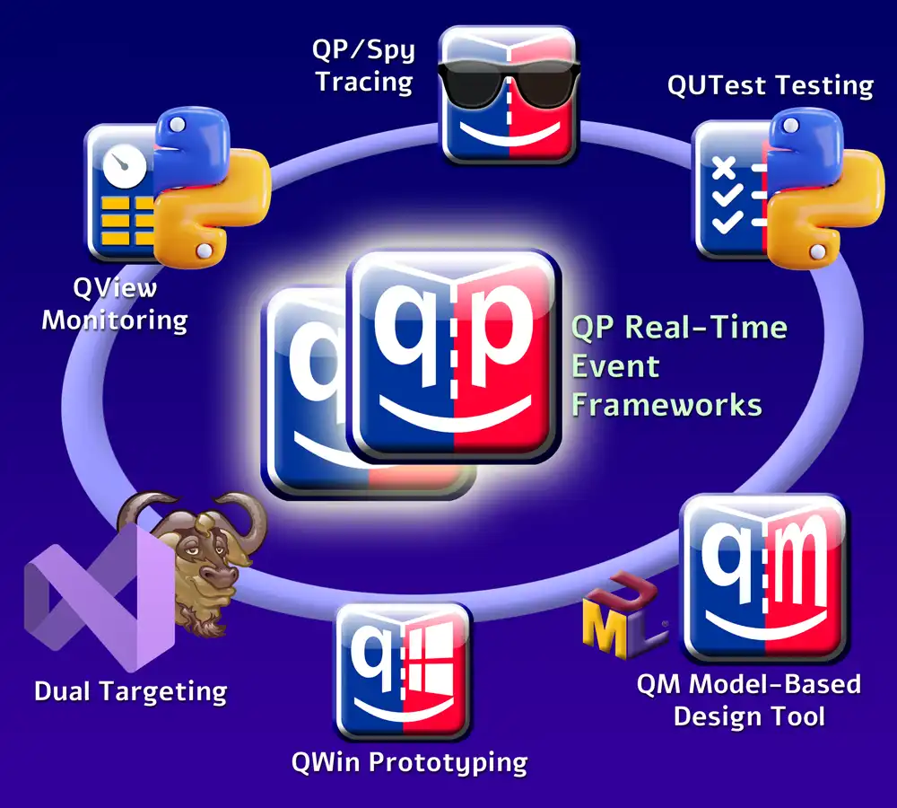
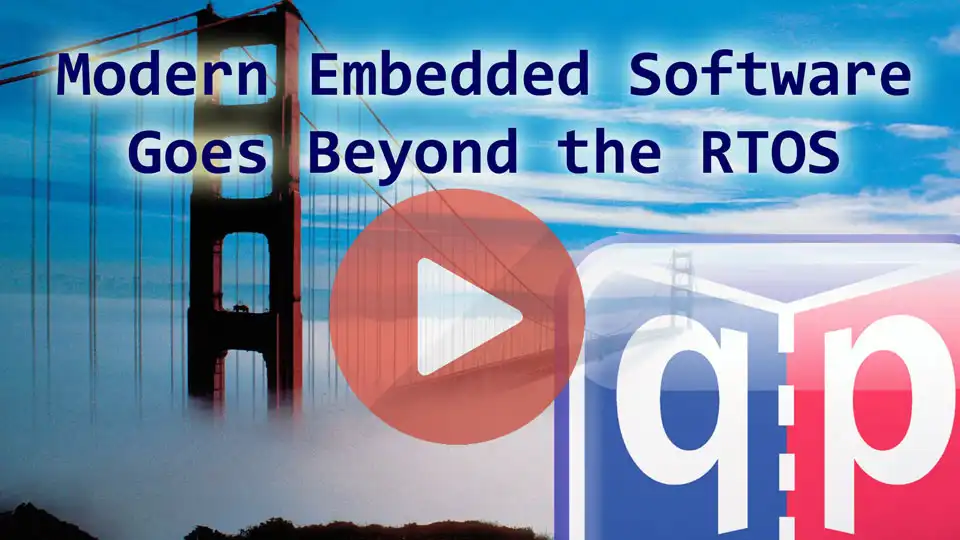

[<b>Quantum Leaps, LLC</b>](https://www.state-machine.com) is a
[professional open source](https://www.state-machine.com/about#OpenSource)
company that brings the asynchronous, event-driven
[Active Objects](https://www.state-machine.com/active-object) (Actor model)
to deeply embedded real-time programming. Quantum Leaps'
[QP Real-Time Event Frameworks (RTEFs)](https://www.state-machine.com/rtef)
and the tools around them enable embedded developers to efficiently apply the
Active Object (Actor) design pattern, hierarchical state machines, graphical
modeling, and automatic code generation.

# State Machines & Tools for Embedded Systems

# Beyond the RTOS
The unique Quantum Leaps ecosystem enables embedded developers to move beyond
the traditional RTOS and apply the
[Active Object (a.k.a. Actor) design pattern](https://www.state-machine.com/qpc/srs-qp_ao.html),
[hierarchical state machines](https://www.state-machine.com/fsm#HSM),
[model based design](https://www.state-machine.com/mbd) and automatic code generation
in small embedded systems, such as ARM Cortex-M MCUs (micro-controller units). Since 2005,
this **asynchronous event-driven approach** and practical, efficient software have been
delivering a competitive advantage to
[hundreds of companies](https://www.state-machine.com/customers/) around the world
in a wide [variety of markets](https://www.state-machine.com/customers/#Markets).

